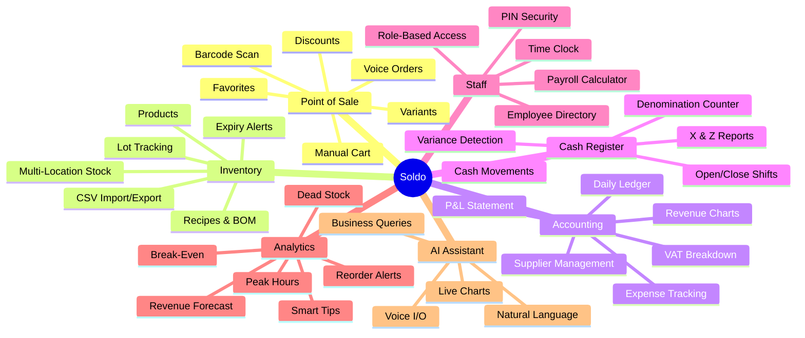
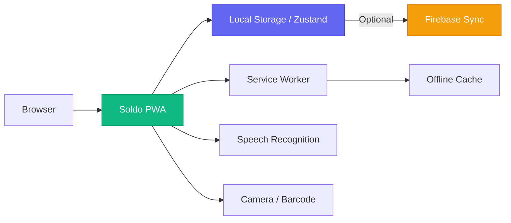

<p align="center">
  
</p>

<h1 align="center">Soldo</h1>

<p align="center">
  <strong>The all-in-one retail management platform that runs entirely in your browser.</strong><br/>
  No servers. No subscriptions. No setup. Just open and start selling.
</p>

<p align="center">
  <a href="#-features"></a>
  <a href="#-quick-start"></a>
  <a href="#-works-offline"></a>
  <a href="#-multi-language"></a>
</p>

<p align="center">
  <a href="https://soldo-pos.vercel.app">🌐 Live Demo</a> · 
  <a href="#-features">📋 Features</a> · 
  <a href="#-screenshots">📸 Screenshots</a> · 
  <a href="#-getting-started">🚀 Getting Started</a>
</p>

---

## 🎯 What is Soldo?

**Soldo** is a complete, offline-first retail management system designed for small-to-medium businesses like shops, boutiques, cafés, and market stalls. It handles everything from ringing up a sale to tracking your profit margins — all from a single web app that works even without internet.

Whether you're managing one shop or multiple locations, Soldo gives you the tools to sell smarter, manage inventory effortlessly, and understand your business at a glance.

> **💡 Everything stays on your device.** Your data is stored locally in your browser — no cloud account required, no monthly fees, and zero vendor lock-in.

---

## ✨ Features

### 📊 Dashboard & Analytics

A powerful at-a-glance overview of your entire business:

- **Real-time KPIs** — Today's revenue, monthly net profit, expense tracking, stock value, and low-stock alerts
- **Fiscal Compliance Panel** — VAT breakdown by rate (22%, 10%, 5%, 4%, 0%) with automatic calculation
- **Expiry Alerts** — Track products nearing expiration with value-at-risk indicators
- **Upcoming Expenses** — See pending bills and overdue payments at a glance
- **Recent Transactions** — Quick access to the latest sales with full details

### 🛒 Smart Point of Sale

Two ways to make a sale — pick what works best for you:

- **Manual Mode** — Search or scan products, add to cart, apply discounts, and checkout
- **Voice Mode** — Speak your order naturally ("two espressos and a croissant, cash payment") and Soldo understands it
- **Barcode Scanner** — Use your device's camera to scan product barcodes directly
- **Favorite Products** — Pin frequently sold items for one-tap access
- **Product Variants** — Handle sizes, colors, or any variation with a selection popup
- **Cash Denomination Calculator** — Count exact bills and coins received and given as change
- **Lottery Code Support** — Italian receipt lottery (Lotteria degli Scontrini) integration
- **Discounts & Notes** — Per-order discounts, customer names, and notes

### 📦 Inventory Management

Full product catalog with advanced stock tracking:

- **Product Catalog** — Name, SKU, barcode, category, cost price, gross price, and VAT rate
- **Multi-Location Stock** — Track inventory separately per store location with transfer support
- **Lot & Batch Tracking** — Receive goods with lot codes, expiry dates, and supplier info (FIFO)
- **Expiry Monitoring** — Automatic alerts when products are expiring soon or already expired
- **Product Variants** — Create parent products with size/color/type variations
- **Composite Products (Recipes/BOM)** — Define products made from ingredients with auto stock deduction
- **Dynamic Pricing Suggestions** — AI-powered price recommendations based on demand and margins
- **Stock Adjustments** — Manual stock corrections with full reason tracking (loss, restock, adjustment)
- **CSV Import/Export** — Bulk import products from CSV or export your catalog
- **Movement History** — Complete audit trail of every stock change

### 💰 Full Accounting Suite

See exactly where your money goes:

- **Profit & Loss Statement** — Revenue, COGS, direct expenses, indirect expenses, EBITDA, VAT, and net profit
- **Revenue Trend Charts** — Daily revenue, costs, and expenses over 7 / 30 / 90 / 365 day ranges
- **VAT Breakdown Charts** — Visual bar charts showing net and VAT amounts by tax rate
- **Payment Mix Analysis** — Pie chart of cash vs. electronic payments
- **Top Products by Revenue** — Horizontal bar chart of your best sellers
- **Expense Management** — Add, edit, and track expenses with categories, suppliers, due dates, and recurrence
- **Supplier Directory** — Manage vendor contacts, VAT numbers, and spending per supplier
- **Recurring Expenses** — Weekly, monthly, quarterly, or yearly auto-rolling expenses
- **Inventory Valuation** — Real-time cost vs. retail value of all stock with potential margin
- **Daily Ledger** — Day-by-day breakdown of receipts, gross, expenses, VAT, and net delta
- **CSV Export** — Export any data to spreadsheet-ready CSV files

### 🏦 Cash Register & Shift Management

Professional cash handling for retail operations:

- **Open/Close Shifts** — Start a shift with an opening float, close with counted cash
- **Cash Denomination Counter** — Bill-by-bill and coin-by-coin counting at open and close
- **X Reports (Mid-Shift)** — Check your register status without closing the shift
- **Z Reports (End of Day)** — Full closing report with variance calculation
- **Cash Movements** — Paid-in (deposits) and paid-out (withdrawals) with reasons
- **Variance Detection** — Instantly see if your counted cash matches the expected amount
- **Thermal Receipt Printing** — Print formatted receipts and reports on 80mm thermal printers
- **Shift History** — Review, reprint, or export any past shift's reports

### 🧑‍💼 Staff & Payroll

Manage your team with built-in HR tools:

- **Employee Directory** — Name, role (Owner / Manager / Cashier), hourly rate, and commission rate
- **Role-Based Access** — Cashiers see limited views; managers and owners see everything
- **PIN-Based User Switching** — Quickly switch operators with a secure 4-digit PIN
- **Time Clock** — Clock in / clock out with visual status and shift history
- **Performance Dashboard** — Hours worked, sales processed, commissions earned per employee
- **Payroll Calculation** — Auto-calculate total pay (hourly base + sales commission)
- **One-Click Expense Posting** — Post an employee's payroll directly to accounting

### 📍 Multi-Location Support

Run multiple stores from one app:

- **Location Management** — Add, edit, and delete store locations with names and addresses
- **Location Switcher** — Instantly switch between locations from the sidebar
- **Per-Location Stock** — Independent inventory counts per store
- **Per-Location Financials** — Revenue, expenses, and profit tracked separately per branch
- **Consolidated Overview** — See all locations side-by-side with global totals
- **Register Status** — Know which branches have open or closed registers
- **Stock Transfers** — Move inventory between locations with tracking

### 🤖 AI-Powered Assistant

A conversational business analyst built right in:

- **Natural Language Queries** — Ask questions in plain Italian or English ("How much did I earn today?", "What's my best-selling product?")
- **Live Charts in Chat** — The assistant generates bar charts, pie charts, and KPI cards right inside the conversation
- **Voice Input & Voice Output** — Speak your question and hear the answer read back to you
- **Sales Analysis** — Revenue, orders, trends, margins — all available through conversation
- **Stock Queries** — "How many units of X do I have?", "What products are low on stock?"
- **Expense Insights** — "How much did I spend this month?", "Show me expense breakdown by category"
- **Staff Queries** — "Who worked the most hours?", "Show me payroll summary"

### 📈 Business Insights & Forecasting

Smart analytics that help you make better decisions:

- **7-Day Revenue Forecast** — Weighted moving average + linear trend projection
- **Sales Trend Analysis** — 30-day vs. previous period growth/decline percentage
- **Reorder Suggestions** — Velocity-based reorder alerts with urgency levels and suggested quantities
- **Dead Stock Detection** — Find products sitting unsold for 30+ days with capital tied up
- **Peak Hour Analysis** — Bar chart showing revenue by hour to optimize staffing
- **Break-Even Calculator** — Know exactly how much revenue you need to cover costs
- **Margin Analysis** — Find your best and worst margin products
- **Actionable Tips** — Data-driven suggestions like "promote electronic payments" or "discount dead stock"

### 🔄 Order Management

Full control over your sales history:

- **Complete Order History** — Every sale with transmission ID, items, payment, and location
- **Advanced Filters** — Search by product, customer, or transaction ID; filter by payment method or status
- **Order Detail View** — Full breakdown of each order with net, VAT, and gross amounts
- **Full & Partial Refunds** — Refund entire orders or select specific items to refund
- **Receipt Printing** — Print formatted receipts with store branding and fiscal info
- **CSV Export** — Export filtered sales data for external analysis

### ⚙️ Settings & Customization

Make Soldo yours:

- **Store Profile** — Store name, address, phone, email, and custom receipt footer
- **Fiscal Credentials** — Partita IVA, Codice Fiscale, and API provider for electronic receipts
- **Theme System** — Light, dark, or system-auto mode with 5 accent color themes
- **Language Toggle** — Switch between Italian and English with one click
- **Low Stock Threshold** — Configure when products trigger low-stock warnings
- **Expiry Alert Window** — Set how many days before expiry to start alerting
- **Backup & Restore** — Export/import your entire database as JSON
- **Factory Reset** — Clear all data and start fresh
- **Activity Log** — Full audit trail of every action taken in the system

### 📱 Works Offline

Soldo is built as an **offline-first Progressive Web App (PWA)**:

- **No Internet Required** — All features work without connectivity
- **Service Worker Caching** — Assets are cached for instant loading
- **Install to Home Screen** — Add Soldo to your phone or desktop like a native app
- **Local Data Storage** — Everything persists in your browser between sessions
- **Cloud Sync** — Optional Firebase sync when you want multi-device access

### 🌍 Multi-Language

Full interface in **Italian** and **English**:

- Every label, button, message, and tooltip is translated
- Switch languages instantly from the sidebar or settings
- AI Assistant understands and responds in both languages
- Voice recognition works in both Italian and English

---

## 🗺️ Feature Map



---

## 📊 Architecture Overview



---

## 🚀 Getting Started

### Quick Start

```bash
# Clone the repository
git clone https://github.com/Dhruu04/Soldo.git

# Navigate to the project
cd Soldo

# Install dependencies
npm install

# Start the development server
npm run dev
```

That's it. Open your browser and start using Soldo.

### Deploy to Vercel

Click the button below to deploy your own instance:

[](https://vercel.com/new/clone?repository-url=https://github.com/Dhruu04/Soldo)

Or deploy manually:

```bash
# Build for production
npm run build

# The output is ready for Vercel deployment
```

---

## 🖥️ Module Overview

| Module | What It Does |
|---|---|
| **Dashboard** | KPIs, fiscal compliance, expiry alerts, recent sales |
| **Sale** | Manual cart + voice ordering + barcode scanning |
| **Inventory** | Product catalog, variants, recipes, lot tracking, transfers |
| **Orders** | Sales history, refunds, receipt printing, CSV export |
| **Locations** | Multi-store overview with consolidated financials |
| **Till** | Shift management, X/Z reports, cash movements |
| **Staff** | Employee directory, time clock, payroll, commissions |
| **Accounting** | P&L, expenses, suppliers, charts, daily ledger |
| **Insights** | Forecasting, reorder alerts, dead stock, peak hours |
| **Assistant** | AI chatbot with natural language + voice + live charts |
| **Settings** | Store profile, fiscal config, themes, backup/restore |

---

## 🎨 Theming

Soldo comes with a built-in theme system:

| Mode | Description |
|---|---|
| ☀️ Light | Clean, bright interface |
| 🌙 Dark | Easy on the eyes for low-light |
| 🖥️ System | Follows your OS preference |

**5 Accent Colors:** Emerald · Indigo · Amber · Rose · Slate

---

## 🇮🇹 Italian Fiscal Compliance

Soldo is designed with Italian retail regulations in mind:

- **Corrispettivi Elettronici** — Automatic electronic receipt transmission
- **VAT Rate Support** — All Italian rates (22%, 10%, 5%, 4%, 0%)
- **Partita IVA / Codice Fiscale** — Built-in validation
- **Lotteria degli Scontrini** — Receipt lottery code support
- **API Providers** — Compatible with Openapi.it, Effatta, and A-Cube

---

## 🔒 Privacy & Security

- **Your data stays on your device** — No external servers, no tracking
- **PIN-based access control** — Each employee has their own PIN
- **Role-based permissions** — Cashiers see only what they need
- **JSON backup** — Export your entire database anytime
- **No accounts required** — No registration, no email, no passwords

---

## 📄 License

This project is open source and available under the [MIT License](LICENSE).

---

<p align="center">
  <strong>Built with ❤️ for small business owners everywhere.</strong><br/>
  <sub>If you find Soldo useful, give it a ⭐ on GitHub!</sub>
</p>
